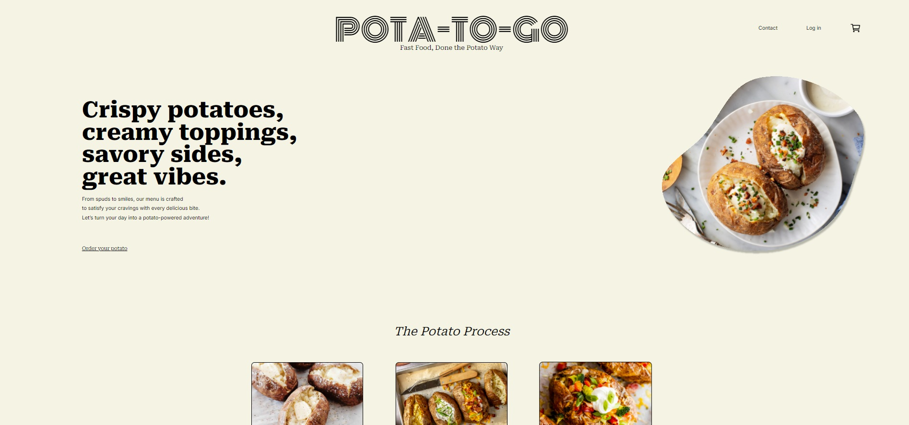

## Pota-To-Go

###Fast Food, Done the Potato Way

## Project Status

In progress

#### Example:

This project is currently in development. Users can view our landingpage and menu, you can also place orders and log in as a user.

## Project Screen Shot:

## Installation and Setup Instructions

Clone down this repository. You will need `node` and `npm` installed globally on your machine.

You will need to also download `React`, `React-router-dom` `Ampify`, `AWS` and `axios`.

Installation:

`npm install`

To Run Test Suite:

`npm test`

To Start Server:

`npm start`

To Visit App:

`localhost:3000`

## Reflection

- Our goal was to create an easy to use resturant page.

- Our main cahllenges was due to issues regarding AWS and Amplify.

We initiated this project by deciding how we would approach it. We wanted to use GitHub Projects as a backlog, mainly as a learning opportunity as none of us had used it before. We wrote all of our user stories and together created tasks based on our interpretation of those. Initially, we did have some difficulties with GitHub Projects but figured it out along the way.
As a group, we decided to use AWS for our backend and TypeScript React for our frontend. During setup, we added Amplify to help with our work in AWS; however, this caused conciderable issues and sadly stalled our progress significantly.
A repository was created, and it was unanimously decided that there would be a dev branch from which each of us would branch out. We also decided that we would name the branches after ourselves and the tasks we were working on.
After this, a restaurant concept and name were decided. We created a board on FigJam where we brainstormed and outlined a rough idea of what we had in mind.
Then, each of us created a draft in Figma, after which we decided what we liked and wanted to keep in our prototype. Reeka was tasked with creating our prototype, which can be seen here.
As some of us felt more comfortable with the backend, we decided that Philip and I would be responsible for the backend, while the rest would start with the frontend. However, this plan was derailed along the way, and Tor helped out with the backend as well. It was generally easier to work on both the backend and frontend for the tasks we had chosen, so by the end, that became the layout of our work.
